# Colombian Amazon Fire & Social Drivers Analysis

## Project overview
This repository contains Earth Engine-based extraction and exploratory analysis workflows focused on burned area, climate drivers, and social/infrastructure variables for a Colombian Amazon nucleus (the five target municipalities). Shared helper modules centralize Earth Engine setup and common processing so notebooks stay concise and reproducible.

## Top-level layout
- `climatic_eda/` — Notebook and outputs for climate-focused exploratory work.
  - `Climatic_EDA.ipynb`: uses the shared helpers to compute or load burned-area and dry-season climate predictors and produce the main drivers panel plot.
- `social_eda/` — Notebook for social and infrastructure variables and spatial mapping.
  - `social_eda.ipynb`: builds the nucleus geometry, loads burned-area baselines, queries MapBiomas and other assets (coca cultivation, roads, parks, rivers), and produces maps and simple tabular summaries.
- `log_regression/` — Baseline machine-learning workflow for fire prediction.
  - `baseline_comparison.ipynb`: builds a logistic-regression baseline from distance-based predictors, climate features, and a spatial-block cross-validation strategy.
- `pedictors_analysis/` — Preliminary predictor construction and feature-engineering notebooks.
  - `preliminar_ML_tests.ipynb`: explores distance predictors and prepares the feature set used by the baseline comparison notebook.
- `nucleus_extraction/` — Extraction and processing utilities / notebooks used to create GEE assets and intermediate exports.
- `datasets/` — Central folder for intermediate CSV exports and reusable tables such as `burned_df.csv`, `climate_df.csv`, and `pixel_year_df.csv`.
- `datasets/derived/` — Optional folder for cleaned or intermediate tables that you want to keep separate from source exports.
- `outputs/` — Saved figures, maps, and notebook-generated artifacts.
- `utils/` — Lightweight compatibility helpers that re-export the shared modules without changing notebook imports.
- `col_amazon_fire_utils.py` — Shared Earth Engine helper module (initialize, nucleus geometry, burned/climate extractors).
- `plot_helpers.py` — Shared plotting helper(s) (e.g., `plot_fire_and_climate`).
- `coca_cultivation.csv` and `datasets/coca_cultivation/*` — Source and cleaned coca cultivation data used by `social_eda`.
- `diagnosis.ipynb` — miscellaneous diagnostics and quick checks run at the repository root.
- `model/` — Model experiments (e.g., Random Forest notebook).
- Additional dataset artifacts in `datasets/` such as `coca_df.csv`, `lulc_area_df.csv`, `spearman.png`, and `fire_and_drivers_panel.png` used for plotting and diagnostics.

## Folder structure diagram

```mermaid
graph TD
  A[repository root]
  A --> B[climatic_eda/]
  A --> C[social_eda/]
  A --> D[log_regression/]
  A --> E[pedictors_analysis/]
  A --> M[model/]
  A --> F[nucleus_extraction/]
  A --> G[datasets/]
  A --> G1[datasets/derived/]
  A --> N[diagnosis.ipynb]
  A --> H[outputs/]
  A --> I[utils/]
  A --> J[col_amazon_fire_utils.py]
  A --> K[plot_helpers.py]
  A --> L[coca_cultivation.csv]
  A --> P[README assets]
  B --> B1[Climatic_EDA.ipynb]
  C --> C1[social_eda.ipynb]
  D --> D1[baseline_comparison.ipynb]
  E --> E1[preliminar_ML_tests.ipynb]
  F --> F1[Data_distribution_thesis.ipynb]
  G --> G1[burned_df.csv]
  G --> G2[climate_df.csv]
  G --> G3[pixel_year_df.csv]
  G --> G4[coca_cultivation/]
  G --> G5[coca_df.csv]
  G --> G6[lulc_area_df.csv]
  G --> G7[spearman.png]
  G --> G8[fire_and_drivers_panel.png]
  H --> H1[figures/climate/]
  H --> H2[figures/social/]
  H --> H3[maps/]
  H --> H4[maps/latest_year_snapshot.png]
  H --> H5[maps/burned_area_quintiles_basemap.png]
  I -.-> I1[compatibility helpers]
```



## Key shared helpers (what they provide)
- `initialize_ee(project='col-amazon-fire-susceptibility')`: initializes Earth Engine with your project context and returns the `ee` module handle.
- `get_nucleus_geometry()`: returns the dissolved geometry of the five target municipalities used across notebooks.
- `get_burned_df(nucleus_geom, start_year=2001, end_year=2025)`: computes (or re-computes) annual burned area inside the nucleus and returns a `pandas.DataFrame`.
- `get_climate_df(nucleus_geom, start_year=2001, end_year=2025)`: computes dry-season climate predictor aggregates for each year and returns a `pandas.DataFrame`.
- `plot_fire_and_climate(burned_df, climate_df, output_path)`: builds and saves the drivers panel chart (used by `Climatic_EDA.ipynb`).

## How to open and run the notebooks
1. Open a terminal in the repository root:

```powershell
cd C:\Users\Natal\dissertation-coding
conda activate fire_thesis
```

2. Install Python dependencies if you haven't already (run inside the `fire_thesis` environment):

```powershell
pip install -r requirements.txt
# or minimally:
pip install pandas matplotlib seaborn earthengine-api geemap geopandas shapely scikit-learn contextily
```

3. Earth Engine authentication (one-time per machine/user):

```powershell
earthengine authenticate
```

4. Open the notebooks in VS Code or Jupyter:
- In VS Code: open the folder, then open the notebook file (`climatic_eda/Climatic_EDA.ipynb`, `social_eda/social_eda.ipynb`, or `log_regression/baseline_comparison.ipynb`).
- In Jupyter: run `jupyter lab` or `jupyter notebook` and open the desired `.ipynb`.

5. Run cells in order. Notes:
- `Climatic_EDA.ipynb` uses the shared helpers in `col_amazon_fire_utils.py` and `plot_helpers.py` and will save intermediate CSVs to `datasets/` to speed repeated runs.
- `social_eda.ipynb` expects the shared helpers as well — it imports `col_amazon_fire_utils` as `utils` in its cells and calls `utils.initialize_ee()` and `utils.get_nucleus_geometry()`; ensure the repository root is on Python's import path (VS Code notebooks usually already set this) or prepend `sys.path.insert(0, os.path.abspath('..'))` in the notebook before importing.
- `baseline_comparison.ipynb` uses the same repo-root import pattern and writes model-ready training tables such as `pixel_year_df.csv` into `datasets/` when available.

## Typical run pattern (quick commands)
```powershell
cd C:\Users\Natal\dissertation-coding
conda activate fire_thesis
earthengine authenticate
pip install -r requirements.txt
# then launch Jupyter/VS Code and open the notebooks
```

## Notes and troubleshooting
- If a notebook fails to import `col_amazon_fire_utils` when run from inside the `social_eda` folder, add the repository root to `sys.path` at the top of the notebook:

```python
import os, sys
sys.path.insert(0, os.path.abspath('..'))
```

- Large Earth Engine operations can be slow; most notebooks save intermediate outputs in `datasets/` to avoid recomputation. Delete those CSVs only if you want a full recompute.
- Ensure your `fire_thesis` Conda environment contains `earthengine-api`, `geemap`, and `geopandas` for full `social_eda` functionality.

## Where to look next
- `climatic_eda/Climatic_EDA.ipynb` — example of how to use the helpers to compute burned/climate tables and produce the main figure.
- `social_eda/social_eda.ipynb` — builds on the same helpers, adds MapBiomas-derived LULC area summaries, coca cultivation time series, and spatial layers (roads, rivers, parks) visualised with `geemap`.
- `log_regression/baseline_comparison.ipynb` — the main modelling workflow used to test a logistic-regression baseline with spatial-block validation.
- `pedictors_analysis/preliminar_ML_tests.ipynb` — feature-generation and preliminary predictor exploration notebook.
- `model/RF_model.ipynb` — Random Forest experiments and model diagnostics.
- `diagnosis.ipynb` — assorted quick diagnostics and exploratory checks.

# 6 july 2026

# Baseline Logistic Regression — Architecture & Log
 
**Project:** Wildfire susceptibility and socio-ecological exposure — Sabanas del Yarí–Bajo Caguán deforestation nucleus, Colombian Amazon
**Component:** Transparent baseline model (logistic regression) for the baseline-vs-ML comparison
**Notebook:** `baseline_comparison.ipynb`
 
---
 
## 1. Purpose
 
This baseline exists to answer a methodological question posed by the supervisor: *why use machine learning instead of a simpler, transparent method?* The logistic regression is the simple, interpretable reference. Random Forest and XGBoost must beat it under identical data and validation to justify their added complexity. All three models read the **same frozen dataset** (`datasets/model_dataset.csv`), so any performance difference comes from the model, not the data.
 
---
 
## 2. Frozen dataset
 
| Property | Value |
|---|---|
| Design | Pixel-year (one row per site × year) |
| Sites sampled | 8,000 requested → survived NDVI masking |
| Years | 2001–2024 (24 dry seasons, Dec[Y-1]–Feb[Y]) |
| Full pixel-year table | 83,184 rows, 2,077 burned (2.5%) |
| **Final stratified dataset** | **6,231 rows** |
| Presences (burned pixel-years) | 2,077 (100% kept) |
| Pseudo-absences | 4,154 |
| Presence : absence ratio | 1 : 2 |
| Exclusion buffer | 3 km (same-year matching) |
| Events per predictor | 231 (rule: ≥10) |
 
**Target:** `burned` = 1 if the pixel burned in that dry season (MODIS MCD64A1 BurnDate > 0), else 0.
 
---
 
## 3. Predictors (9)
 
**Anthropogenic — distance rasters (time-invariant, present conditions):**
 
| Predictor | Source | Search radius | Notes |
|---|---|---|---|
| `dist_roads` | OpenStreetMap (asset `osm_roads_v2`) | 10 km | Replaced an empty official layer (6 → 8,731 segments) |
| `dist_parks` | National Natural Parks | 100 km | Larger radius: avoidance operates broad-scale |
| `dist_coca` | UNODC-SIMCI grid (historical presence, any year 2001–2023) | 10 km | Distance to *ever*-coca cells |
| `dist_mosaic` | MapBiomas Col. 3, group 5, `fastDistanceTransform` | 10 km | Real agropecuario frontier proxy (no pure "pasture" class in nucleus) |
 
**Climatic — dry-season averages (pixel-varying):**
 
| Predictor | Source |
|---|---|
| `temp_C` | ERA5-Land 2 m temperature |
| `vpd_kPa` | Derived (Tetens) from T + dewpoint |
| `ndvi` | MODIS MOD13A1 |
| `wind_ms` | ERA5-Land hypot(u, v) |
 
**Temporal:**
 
| Predictor | Source |
|---|---|
| `oni` | ENSO Oceanic Niño Index, DJF, NOAA CPC (spatially constant per year) |
 
**Metadata (NOT predictors):** `lon`, `lat` (spatial blocks), `year` (temporal split).
 
---
 
## 4. Diagnostics performed and decisions
 
**Spearman (predictor redundancy).** Strong pairs (|ρ| > 0.7): `rh_pct ↔ vpd_kPa` = −0.94, `precip_mm ↔ rh_pct` = +0.77, `precip_mm ↔ vpd_kPa` = −0.75. → The humidity block (RH, precip, VPD) measures one dimension.
 
**VIF (multicollinearity).** Initial 10-predictor set: severe (temp_C 929, rh_pct 612, ndvi 131, vpd_kPa 112, precip 42, wind 27). → **Dropped `rh_pct` and `precip_mm`**, kept `vpd_kPa` as the single "dryness" representative (most fire-relevant). Reduced 8-predictor VIF: all 1.2–2.0 (healthy). Anthropogenic predictors always healthy (2.5–4.1).
 
**Moran's I (target autocorrelation).** Global I = 0.329, p = 0.001 → fire is significantly spatially clustered → justifies spatial-block validation. Correlogram: I = 0.46 (1 km) → 0.41 (3 km) → 0.35 (7.5 km); elbow ≈ 3 km → **exclusion buffer set to 3 km**.
 
---
 
## 5. Sampling strategy
 
- **Stratified with pseudo-absences:** all presences retained; absences drawn at 2× presences.
- **Rationale for 1:2:** natural rate (~2.5%) makes the model ignore the minority class; 1:1 over-predicts susceptibility; 1:2 is the middle ground, consistent with Barbet-Massin et al. (2012) and recent susceptibility studies (1:1–1:2).
- **Exclusion buffer (3 km):** absences within 3 km of a same-year presence are removed to avoid ambiguous negatives (possible unrecorded fire). Removed 2,229 of 81,107 candidates.
- **Sample-size justification:** not a fraction of the population (449,160 pixels), but statistical sufficiency — 231 events per predictor (Peduzzi et al., 1996: ≥10) and spatial redundancy proven by Moran's I.
---
 
## 6. Validation design
 
**Spatial block CV** — `GroupKFold` (5 folds) on 0.25° (~27 km) blocks (~110 blocks). Whole blocks stay in one fold → tests generalisation to *new places*, removes the inflation of a random split.
 
**Temporal split** — train ≤ 2019 (1,828 events, ~5,484 rows), test ≥ 2020 (249 events, ~747 rows). Tests generalisation to *new years*. Note: 2023 and 2024 have low fire activity (10 events each) — the temporal metric is dominated by 2020–2022; declared as a limitation.
 
---
 
## 7. Metrics
 
| Metric | Role |
|---|---|
| **AUC-ROC** | Primary — ranking ability, robust to imbalance |
| **PR-AUC** (average precision) | Primary — appropriate for rare events |
| **F1** | Contextual only — expected low under imbalance; reported for transparency, not as the decision metric |
 
Threshold-dependent metrics (F1) are secondary because the product is a **susceptibility ranking**, not a hard classification. Outputs are relative (pseudo-)probabilities, to be presented in susceptibility classes (quintiles), not as calibrated probabilities.
 
---
 
## 8. Model configuration
 
- `LogisticRegression(max_iter=1000, class_weight='balanced')`
- `StandardScaler` fit **on the training fold only** (no leakage), applied to test.
- `lon`, `lat`, `year` excluded from predictors.
---
 
## 9. Bitácora — chronological log of key decisions
 
1. **Target = MODIS MCD64A1** burned area, dry-season Dec–Feb window.
2. **Real predictors are distances, not raw layers** — RF/XGBoost are not spatially aware; distance encodes proximity/gradient.
3. **Roads fixed via OpenStreetMap** — official layer had 6 segments in the nucleus; OSM gave 8,731. Median burned-pixel distance dropped from 67 km (broken) to 1.1 km (valid).
4. **Coca = historical presence** (any year 2001–2023), not a single-year snapshot, because the coca footprint persists.
5. **Search radius by feature scale** — 10 km for local effects (roads, coca, mosaic; 95th pct of burned distances ≤5.6 km), 100 km for parks (broad-scale avoidance).
6. **Logistic over linear regression** — binary target; the sigmoid keeps output in [0,1] as a probability.
7. **Climate reduced to 4 predictors** — VIF removed rh_pct and precip_mm (redundant with VPD).
8. **ONI added as the temporal predictor** — continuous index (intensity), not a categorical ENSO label; `year` itself is NOT a predictor (would not generalise to the 2026 snapshot).
9. **Pixel-year spatio-temporal design** — same table serves both spatial-block and temporal validation; averaged climate reserved only for painting the final 2026 snapshot.
10. **Stratified 1:2 with 3 km exclusion buffer** — buffer size from the Moran's I correlogram.
11. **Resolution harmonised to 500 m** (nearest-neighbour resampling in GEE); ERA5-Land retains coarse effective resolution (~9 km). Training at 500 m (matches MODIS target); final map may be painted at 250 m for legibility, with the caveat that fine detail comes from anthropogenic/vegetation predictors.
---
 
## 10. Declared limitations
 
- Averaged dry-season climate loses intra-seasonal extremes and interannual timing (the "when" between years); mitigable with extreme aggregates.
- OSM roads are a 2023 snapshot, not a temporal series (declared as accumulated state).
- ONI is spatially constant → aids temporal, not spatial, discrimination.
- Stratification changes the base rate → outputs are relative susceptibility, presented in quintiles.
- 2023–2024 have few fire events → temporal metric is dominated by 2020–2022.

# 15 july 2026

## Latest updates

- Added a dedicated Random Forest training notebook for the modelling workflow.
- Added a tuning notebook for GridSearch-based model selection with spatial-block cross-validation.
- Compared Logistic Regression and Random Forest using the same frozen dataset and evaluation protocol.
- Used 10 spatial folds for validation and reported PR-AUC on the temporal hold-out as the main comparison metric.
- Kept the existing repository documentation intact and appended this update log for traceability.