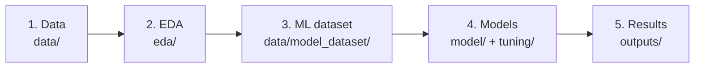

# WORKFLOW — how this project works, explained from scratch

This document explains the full project flow for someone who has **never worked with
Machine Learning**. If this is your first time here, read it end to end before touching
any notebook.

## The question this project answers

> Where in the Colombian Amazon (Sabanas del Yarí–Bajo Caguán nucleus) is a wildfire
> most likely to occur, given current conditions?

This is not a weather forecast ("will it rain tomorrow?"). It's a **spatial
susceptibility map**: given typical dry-season climate and current human pressure
(roads, coca crops, agricultural frontier, proximity to parks), which areas are more
prone to burning?

## The full flow, in 5 steps

### Step 1 — The data ([`data/`](data/))
Everything starts with raw data (road/park/coca shapefiles) and satellite data queried
directly from Google Earth Engine (MODIS fire, ERA5 climate, MapBiomas land cover). See
[`data/README.md`](data/README.md).

### Step 2 — Understand the data before modelling ([`eda/`](eda/))
Before training any model, the data is explored: does fire relate to climate? To coca?
Is it spatially clustered? These questions are answered with charts and simple
statistics (correlation, VIF, Moran's I) — no prediction yet. See
[`eda/README.md`](eda/README.md).

**Key EDA finding:** 2023 was the driest year (worst climate) but had LITTLE fire. This
means climate alone doesn't explain the fires — human variables (roads, coca,
agricultural frontier) must be included, and a model capable of capturing those
relationships is needed. This motivates the rest of the project.

### Step 3 — Build the Machine Learning dataset ([`data/model_dataset/`](data/model_dataset/))
A single table (`model_dataset.csv`) is assembled with one row per place × year
combination, where each row has:
- **9 predictor variables** (distances to roads/parks/coca/agricultural frontier + 4
  climate variables + the ENSO climate index).
- **The target variable** (`burned`: 1 if that place burned that year, 0 if not).

This dataset is "frozen" — once created, ALL models use it as-is, so the comparison
between models is fair (the only difference between models is the model itself, not the
data).

### Step 4 — Train and compare models ([`model/`](model/) + [`tuning/`](tuning/))
A simple, transparent model (logistic regression) is trained first as a baseline, then
more complex models (Random Forest, XGBoost) to see whether they actually improve
performance. Each model is evaluated two ways:
- **Spatial validation:** does the model generalise to PLACES it has never seen?
- **Temporal validation:** does the model generalise to YEARS it has never seen?

The three models were compared side by side in [`tuning/v4/`](tuning/v4/README.md),
which selected **Random Forest** as the final model — see
[`model/README.md`](model/README.md) for each model's detail and
[`tuning/README.md`](tuning/README.md) for the full tuning history.

### Step 5 — See the results ([`outputs/`](outputs/))
All charts, maps, metric tables, SHAP results, and the final deployed susceptibility map
live here, organised by type. See [`outputs/README.md`](outputs/README.md).

## How to interpret the numbers you'll see

| Term | What it means, simply |
|---|---|
| **AUC-ROC** | How well the model distinguishes "burned" from "not burned". 0.5 = random guessing, 1.0 = perfect. |
| **PR-AUC** | Like AUC-ROC, but stricter when the event is rare (here only ~2.5% of cases are fires in the raw, unbalanced data). Important whenever the evaluation set isn't artificially balanced. |
| **F1** | Balance between "don't miss any fire" and "don't over-flag". Depends on a decision threshold, so it's secondary. |
| **Spatial vs. temporal validation** | Spatial = "does it work in new places?". Temporal = "does it work in new years?". A good model should be strong in both, but for a STATIC map (a single snapshot of risk), spatial generalisation matters most. |
| **"Frozen" dataset** | Once the training dataset is built, it isn't touched again — so no model gets an unfair advantage from using different data. |
| **Pseudo-absences** | Since fire is a rare event, a sample of "not burned" locations is drawn (rather than using every unburned pixel) — otherwise the model would learn to always predict "no fire" and be right 97.5% of the time without being useful. |
| **Susceptibility, not forecast** | The model doesn't say "next year location X will burn." It says "given typical conditions, this location is more fire-prone than that one." It's a snapshot, not a prediction over time. |

## Roadmap

1. ~~**XGBoost**~~ — done, see [`model/xgboost/README.md`](model/xgboost/README.md) and
   the later three-model comparison in [`tuning/v4/`](tuning/v4/README.md).
2. ~~**SHAP**~~ — done, see [`outputs/shap/README.md`](outputs/shap/README.md).
3. **Jenks classification** — turn the continuous probability surface into 5 discrete
   susceptibility classes (Very low → Very high). Not yet done; can be done directly in
   ArcGIS (`Symbology → Classify → Jenks`) or in a follow-up notebook.
4. ~~**2026 map**~~ — done, the winning model (Random Forest, v4) was applied to every
   pixel of the study nucleus. See [`outputs/probability_map/`](outputs/probability_map/README.md).
5. **Socio-ecological exposure & carbon at risk** — overlay the susceptibility map with
   land cover, parks, and forest carbon layers. Not yet done.

## Golden rules for not breaking anything

- **Don't edit `data/model_dataset/model_dataset.csv` by hand.** If you need to change
  it, do so from the notebook that generates it
  ([`model/logistic_regression/baseline_comparison.ipynb`](model/logistic_regression/baseline_comparison.ipynb))
  and delete it first to force a recalculation.
- **Don't move a notebook to a different folder without checking its `sys.path.insert(...)`
  calls and its file read/write paths.** Every notebook "knows" how many levels to go up
  based on where it lives — if you move it, that number has to be updated (see
  [`README.md`](README.md), "Path convention" section).
- **`lon`, `lat`, and `year` are never predictors** of the model (it would break the
  model's ability to generalise). `oni` (the ENSO index) IS a valid predictor because it
  describes a climate condition, not a time label.
