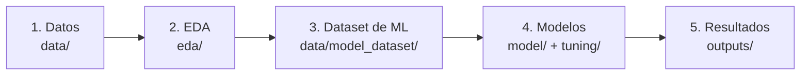

# WORKFLOW — Cómo funciona este proyecto, explicado desde cero

Este documento explica el flujo completo del proyecto para alguien que **nunca ha
trabajado con Machine Learning**. Si es tu primera vez aquí, léelo de principio a fin
antes de tocar cualquier notebook.

## La pregunta que responde el proyecto

> ¿En qué lugares de la Amazonía colombiana (núcleo Sabanas del Yarí–Bajo Caguán) es
> más probable que ocurra un incendio, dadas las condiciones actuales?

No es un pronóstico del tiempo ("¿lloverá mañana?"). Es un **mapa de susceptibilidad
espacial**: dado el clima típico de temporada seca y la presión humana actual (caminos,
cultivos de coca, frontera agropecuaria, cercanía a parques), ¿qué zonas son más
propensas a arder?

## El flujo completo, en 5 pasos

### Paso 1 — Los datos ([`data/`](data/))
Todo empieza con datos crudos (shapefiles de caminos/parques/coca) y datos de satélite
consultados directamente desde Google Earth Engine (fuego MODIS, clima ERA5, cobertura
del suelo MapBiomas). Ver [`data/README.md`](data/README.md).

### Paso 2 — Entender los datos antes de modelar ([`eda/`](eda/))
Antes de entrenar cualquier modelo, se exploran los datos: ¿el fuego se relaciona con
el clima? ¿con la coca? ¿está agrupado espacialmente? Estas preguntas se responden con
gráficos y estadística simple (correlación, VIF, Moran's I) — sin predecir nada
todavía. Ver [`eda/README.md`](eda/README.md).

**Hallazgo clave del EDA:** 2023 fue el año más seco (peor clima) pero tuvo POCO fuego.
Esto significa que el clima solo no explica los incendios — hay que incluir variables
humanas (caminos, coca, frontera agrícola) y usar un modelo capaz de capturar esas
relaciones. Esto justifica todo el resto del proyecto.

### Paso 3 — Construir el dataset de Machine Learning ([`data/model_dataset/`](data/model_dataset/))
Se arma UNA tabla (`model_dataset.csv`) con una fila por cada combinación de
lugar × año, donde cada fila tiene:
- **9 variables predictoras** (distancias a caminos/parques/coca/frontera agrícola +
  4 variables de clima + el índice climático ENSO).
- **La variable a predecir** (`burned`: 1 si ese lugar se quemó ese año, 0 si no).

Este dataset es "congelado" — una vez creado, TODOS los modelos lo usan tal cual, para
que la comparación entre modelos sea justa (la única diferencia entre modelos es el
modelo mismo, no los datos).

### Paso 4 — Entrenar y comparar modelos ([`model/`](model/) + [`tuning/`](tuning/))
Se entrena primero un modelo simple y transparente (regresión logística) como línea
base, y luego modelos más complejos (Random Forest, y próximamente XGBoost) para ver si
realmente mejoran el desempeño. Cada modelo se evalúa de dos formas:
- **Validación espacial:** ¿el modelo generaliza a LUGARES que nunca vio?
- **Validación temporal:** ¿el modelo generaliza a AÑOS que nunca vio?

Ver [`model/README.md`](model/README.md) para el detalle de cada modelo, y
[`tuning/v1/README.md`](tuning/v1/README.md) para la tabla comparativa final.

### Paso 5 — Ver los resultados ([`outputs/`](outputs/))
Todos los gráficos, mapas y (próximamente) tablas de métricas y SHAP quedan guardados
aquí, organizados por tipo. Ver [`outputs/README.md`](outputs/README.md).

## Cómo interpretar los números que vas a ver

| Término | Qué significa, en simple |
|---|---|
| **AUC-ROC** | Qué tan bien el modelo distingue "se quemó" de "no se quemó". 0.5 = adivinar al azar, 1.0 = perfecto. Un AUC de 0.88 (nuestro mejor modelo) es bastante bueno. |
| **PR-AUC** | Como el AUC-ROC, pero más estricta cuando el evento es raro (aquí solo ~2.5% de los casos son incendios). Es nuestra métrica más importante. |
| **F1** | Balance entre "no perderme ningún incendio" y "no marcar de más". Depende de un umbral de decisión, por eso es secundaria. |
| **Validación espacial vs. temporal** | Espacial = "¿funciona en lugares nuevos?". Temporal = "¿funciona en años nuevos?". Un buen modelo debería ser fuerte en ambas, pero para un mapa ESTÁTICO (una sola foto del riesgo), lo más importante es que generalice bien en el espacio. |
| **Dataset "congelado"** | Una vez armado el dataset de entrenamiento, no se vuelve a tocar — así ningún modelo tiene ventaja por usar datos distintos. |
| **Pseudo-ausencias** | Como el fuego es un evento raro, se toma una muestra de lugares "no quemados" (2 por cada lugar quemado) en vez de usar todos los pixeles sin fuego — si no, el modelo aprendería a decir siempre "no se quema" y tendría razón el 97.5% del tiempo sin ser útil. |
| **Susceptibilidad, no pronóstico** | El modelo no dice "el año que viene se quemará X". Dice "dadas las condiciones típicas, este lugar es más propenso a arder que aquel otro". Es una foto fija (snapshot), no una predicción en el tiempo. |

## Qué falta por hacer

1. **XGBoost** — tercer modelo, mismo protocolo. Ver [`model/xgboost/README.md`](model/xgboost/README.md).
2. **SHAP** — abrir la "caja negra" del Random Forest para confirmar qué variables
   realmente importan. Ver [`outputs/shap/README.md`](outputs/shap/README.md).
3. **Clasificación Jenks** — convertir las probabilidades del modelo en 5 clases
   (Muy bajo → Muy alto) para el mapa final.
4. **Mapa 2026** — aplicar el mejor modelo a todo el núcleo de estudio.
5. **Exposición socio-ecológica y carbono en riesgo** — cruzar el mapa de
   susceptibilidad con cobertura del suelo, parques y carbono forestal.

## Reglas de oro para no romper nada

- **No modifiques `data/model_dataset/model_dataset.csv` a mano.** Si necesitas
  cambiarlo, hazlo desde el notebook que lo genera
  ([`model/logistic_regression/baseline_comparison.ipynb`](model/logistic_regression/baseline_comparison.ipynb))
  y bórralo primero para forzar que se recalcule.
- **No muevas un notebook de carpeta sin revisar sus `sys.path.insert(...)` y rutas de
  lectura/escritura de archivos.** Cada notebook "sabe" cuántos niveles subir según
  dónde vive — si lo mueves, hay que actualizar ese número (ver
  [`README.md`](README.md), sección "Convención de rutas").
- **`lon`, `lat` y `year` nunca son predictores** del modelo (rompería la capacidad de
  generalizar). `oni` (el índice ENSO) sí es un predictor válido porque describe una
  condición climática, no una etiqueta de tiempo.
